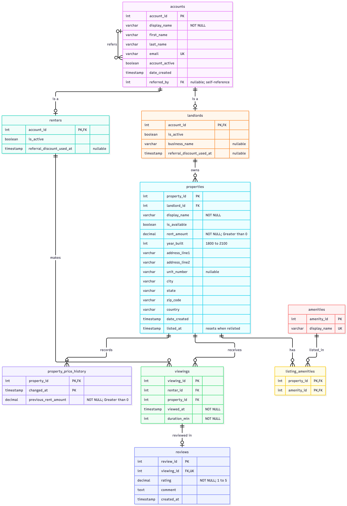

# Rental Marketplace Database
A relational database for a rental market place management including viewings and property's amenities.

**Author:** Mohamed Bouattour

**Chosen theme:** Rental Marketplace

## Domain

This project models the data needed by a rental marketplace. 
The Database will contain records of renter accounts, properties in the market and keeps track of viewings and amenities in each property.

Properties can offer multiple amenities that can be associated with many properties. 
A renter can go to multiple viewings.

The database should be able to answer questions such as:
- What's the rent amount for available properties and where are they located?
- What are all the amenities offered by a particular property and which propreties have a particular amenity?
- Which properties a renter viewed? Which renters viewed a specific property? How often a property was viewed, and how much time renters spent viewing it.

## Entity Relationship Diagram

